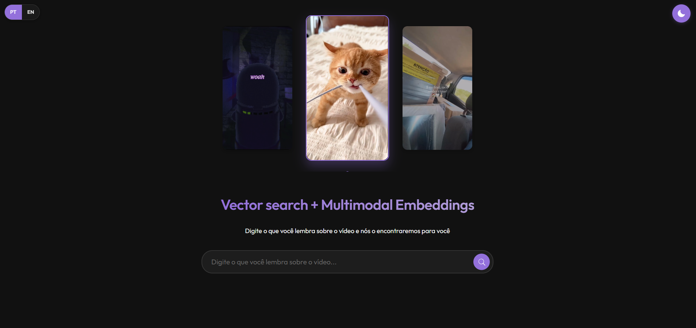

# Vector Search + Multimodal Embeddings Interface

This project demonstrates a modern interface for semantic vector search and multimodal embeddings, allowing users to find videos through natural language queries.

## Overview

The interface showcases how vector search can be used to retrieve videos based on the semantic meaning of user queries, not just exact keyword matches. It simulates a production environment where video content can be discovered through natural language descriptions.



## Features

- **Semantic Vector Search**: Find videos by describing what you remember about them
- **Multilingual Support**: Switch between English and Portuguese interfaces
- **Dark/Light Theme Toggle**: Choose your preferred visual mode
- **Responsive Design**: Works across desktop and mobile devices
- **Video Carousel**: Featured videos displayed in an interactive carousel
- **Interactive Results**: Preview videos by hovering over search results

## Technical Details

The interface is built using:
- HTML5
- CSS3 with custom properties for theming
- Vanilla JavaScript (no frameworks)
- Local storage for persisting user preferences
- A simulated API (for demonstration purposes)

## Getting Started

### Prerequisites

This is a client-side only application with no server dependencies. You only need:
- A modern web browser (Chrome, Firefox, Safari, Edge)
- Optional: A local web server if you want to avoid CORS issues with video files

### Installation

No installation is required. Simply clone or download the repository:

```bash
git clone https://github.com/yourusername/vector-search-project.git
cd vector-search-project
```

### Running the Application

You can run the application in several ways:

1. **Open directly in browser**:
   - Simply open the `index.html` file in your browser

2. **Using a local server** (recommended):
   - Using Python:
     ```bash
     # Python 3
     python -m http.server 8000
     # Then visit http://localhost:8000 in your browser
     ```
   - Using Node.js:
     ```bash
     # Install http-server if not installed
     npm install -g http-server
     # Run the server
     http-server -p 8000
     # Then visit http://localhost:8000 in your browser
     ```

## Usage

1. **Search for videos**: Type what you remember about a video in the search box
2. **Toggle language**: Click the language selector (PT/EN) in the top left corner
3. **Switch theme**: Click the moon/sun icon in the top right corner
4. **Browse featured videos**: Use the carousel indicators or wait for automatic rotation
5. **Preview videos**: Hover over search results to see the videos play

## Project Structure

```
vector-search-project/
│
├── index.html          # Main HTML file
├── css/
│   └── style.css       # Styles and theme configurations
├── javascript/
│   └── main.js         # Application logic and simulated API
└── assets/
    ├── video1.mp4      # Sample video content
    ├── video2.mp4      # Sample video content
    └── video3.mp4      # Sample video content
```

## Future Improvements

- Integration with a real backend for actual vector search implementation
- User accounts and saved searches
- More comprehensive multilingual support
- Additional filtering options
- Analytics for search performance

## License

This project is licensed under the MIT License - see the LICENSE file for details. 